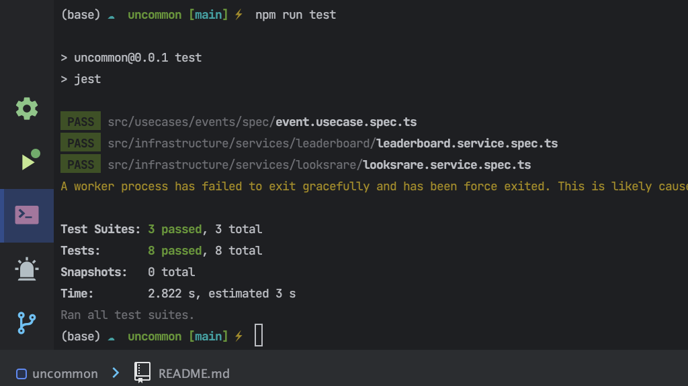

# Uncommon

## Documentation of Uncommon

## Author 🚀

> ADEBAYO EMMANUEL TOLUWANIMI
---

## Question

1. Use your skills in NodeJS and PostgreSQL to develop a script that will fetch the listing and offer orders for a given
   collection from the LooksRare API. The response data should be stored in respective tables for collections, items,
   and orders. You are also required to create an API endpoint that accepts query parameters for filtering orders by
   type, price range, page offset. The endpoint should return up to 10 active orders at a time sorted by price (as asc
   or desc depending on order type). The payload should include order ID, price in wei and ether, expiration, and maker,
   as well as collection & item details, including the current collection floor price. You should note differences in
   order types and exclude any multi-item (bundles) or trait orders. Take time to consider database structure and any
   indexes that would optimize read queries.

2. Use your skills to develop a script using Redis and NodeJS. The script should take an array of JSON data from a file
   and store different sets that track the number of clients watching a particular entry and collection. Additionally,
   you should return sorted sets of the 10 most followed entries and the 10 most followed collections overall.
   File: https://gist.github.com/gleuch/687043d7a048c81e711a98dfc0a24eaa

## Technologies

- Node JS
- NestJS
- Typeorm
- Redis
- BullJS
- Typescript

---

## Database

- [Postgres](https://www.postgresql.org/) (TypeORM)

---

## Install NodeJS

To Install NodeJS, kindly go to [Nodejs](https://nodejs.com) and follow the necessary instructions required depending on
your PC Operating System

## MACOS

using a [package](https://nodejs.org/en/#download) simply download the installer

using [homebrew](https://github.com/Homebrew/legacy-homebrew)

```markdown
brew install node
```

---

## Windows

using a [package](https://nodejs.org/en/#download) simply download the installer

using [chocolatey](http://chocolatey.org/) to install Node

```markdown
cinst nodejs
```

---

## To install Postgres

For Windows users, you can kindly follow this
tutorials [here](https://learnsql.com/blog/how-to-install-postgresql-on-windows-in-5-minutes/) to install Postgres on
your local PC which explains how to create a database

For Mac users, you can kindly follow this tutorials [here](https://www.robinwieruch.de/postgres-sql-macos-setup)  to
install Postgres on your local PC which explains how to create a database

## Start Development

Kindly clone the repo `https://github.com/toluwaanimi/uncommon-task.git`

### Installation

To install the necessary packages, in your folder directory kindly run

```markdown
npm i

# or

yarn add
```

* To continuously watch for changes

 ```markdown
     npm run start:dev
```

* To build your app for production

```markdown
      npm run build
```

* To run your app server for production

```markdown
      npm run start
```

* To run your E2E Test

```markdown
      npm run test:e2e
```

* To run your Test

```markdown
 npm run test 
```

# Docker Image

To run a docker image of Postgres and Redis

```text
  docker-compose up
  ```

---

# Domain Driven Architecture

The approach of Domain Driven Architecture (DDA) was taken in this project to ensure that the code is organized around
the business domain. This approach emphasizes the importance of understanding the business domain and modeling it in the
code.

In DDA, each module is organized around a specific domain concept. This allows for better separation of concerns and
easier maintenance of the codebase. The main benefits of this approach are:

* Clear Separation of Concerns: Each module contains the code that is relevant to a specific domain concept, making it
  easier to understand and maintain.
* Better Collaboration: When the code is organized around the business domain, it is easier for the development team and
  stakeholders to collaborate and communicate effectively.
* Flexibility: DDA allows for greater flexibility in the codebase, making it easier to adapt to changes in the business
  domain.

## Folder Structure

The project is structured in the following way:

## Folder Descriptions

- `src/domain/`: Contains the domain layer of the application, which is responsible for the business logic and data
  modeling.
    - `adapters/`: Contains adapters for external interfaces and services that the application interacts with.
    - `config/`: Contains configuration files for the domain layer.
    - `exceptions/`: Contains custom exceptions for the domain layer.
    - `logger/`: Contains logging setup and utilities for the domain layer.
    - `model/`: Contains the application domain models and types.
    - `repositories/`: Contains repository interfaces for the domain models.
- `src/infrastructure/`: Contains the infrastructure layer of the application, which is responsible for the
  implementation details such as data access and external API integrations.
    - `background/`: Contains background jobs like Cron and Redis Job Handlers.
    - `common/`: Contains shared code and utilities for the infrastructure layer.
    - `config/`: Contains configuration files for the infrastructure layer.
    - `controllers/`: Contains controllers for the HTTP endpoints.
    - `entities/`: Contains database entities for the domain models.
    - `logger/`: Contains logging setup and utilities for the infrastructure layer.
    - `repositories/`: Contains concrete implementations of the repository interfaces.
    - `services/`: Contains services for the domain logic and data access.
    - `usecase-proxy/`: Contains use case proxies for external API integrations.
- `src/usecases/`: Contains the use cases (business logic) of the application.
    - `events/`: Contains event handlers for domain events.
    - `general-usecase-proxy.module.ts/`: Contains a general use case proxy module.
    - `usecase-proxy.ts/`: Contains the class for use case proxies.
- `src/main.ts`: The entry point of the application.
- `README.md`: The readme file for the project.

This folder structure and descriptions should help you navigate the project and understand the purpose of each folder.

# Solution 1: Fetching and Storing Data from LooksRare API

# Data Structure in TypeORM Entities

There are four TypeORM entities that define the data structure for different aspects of the
project: `Collection`, `Event`, `Order`, and `Token`.

## Collection Entity

The `Collection` entity represents a collection of tokens. It has properties such as `name`, `description`,
and `logoURI` that provide information about the collection. It also has relationships with other entities, such as
an `event` and a `token`.

## Event Entity

The `Event` entity represents an event that occurred related to a collection, such as a transfer or a sale. It has
properties such as `from`, `to`, and `hash` that provide information about the event. It also has a relationship with
the `Collection` entity.

## Order Entity

The `Order` entity represents an order to buy or sell a token. It has properties such as `price`, `status`,
and `signature` that provide information about the order. It also has a relationship with the `Collection` entity.

## Token Entity

The `Token` entity represents a unique token within a collection. It has properties such as `name`, `description`,
and `imageURI` that provide information about the token. It also has a relationship with the `Collection` entity.

In all of these entities, there is an `AbstractEntity` class that defines common properties such
as `created_at`, `updated_at`, and `deleted_at`. By extending this class, each entity inherits these properties and has
a consistent structure across the project.

Overall, the data structure in these TypeORM entities provides a way to represent and manage data related to
collections, events, orders, and tokens in the project. By using TypeORM, it is easy to define and manage the
relationships between these entities and to interact with the data in a consistent and reliable way.

# Database Entity Relationship Diagram

Here is a visual representation of the relationships between the different entities in the project's database:

                        +-----------------------+
                        |         Token         |
                        +-----------+-----------+
                                    |
                                    |
                      +-------------+-------------+
                      |                           |
    +-----------------+---------------+   +-----+-----+
    |          Collection             |   |    Order    |
    +-----------------+---------------+   +-----+-----+
                      |                           |
                      |                           |
        +-------------+--------------+            |
        |            Event            |           |
        +-------------+--------------+            |
                      |                           |
                      +---------------------------+

# Indexes

# Indexes in TypeORM Entities

There are four TypeORM entities that define the data structure for different aspects of the
project: `Collection`, `Event`, `Order`, and `Token`. Each of these entities has one or more indexes defined to optimize
read queries.

## Collection Entity Indexes

The `Collection` entity has a single index defined on the `address` column. This index helps to speed up queries that
filter collections by their address.

## Event Entity Indexes

The `Event` entity has two indexes defined: one on the `hash` column and one on the `collection` relationship. The index
on the `hash` column helps to speed up queries that filter events by their hash value. The index on the `collection`
relationship helps to speed up queries that join events with their associated collection.

## Order Entity Indexes

The `Order` entity has four indexes defined: one on the `collection` relationship, one on the `status` column, one on
the `price` column, and one on the `createdAt` column. The index on the `collection` relationship helps to speed up
queries that join orders with their associated collection. The index on the `status` column helps to speed up queries
that filter orders by their status. The index on the `price` column helps to speed up queries that sort orders by their
price. The index on the `createdAt` column helps to speed up queries that filter orders by their creation date.

## Token Entity Indexes

The `Token` entity has a single index defined on the `collection` relationship. This index helps to speed up queries
that join tokens with their associated collection.

By defining these indexes, the entities in the project's database are optimized for read queries, which can help to
improve the overall performance of the application.

# Using BullJS to Manage Background Jobs

BullJS is a Node.js library for creating and managing background jobs. It is useful for handling complex tasks that may
take a long time to complete, such as sending emails, processing large amounts of data, or scheduling tasks on a
specific interval.

To use BullJS, you can create a new job that runs on a schedule and performs a specific task. For example, we used
BullJS to pull data from the LooksRare API and insert it into a database at regular intervals.

To access the BullJS dashboard, you can simply go to `http://localhost:3000/admin/queues` in your web browser. Here, you
can monitor the progress of your jobs, view job details, and manage your queues.

In summary, BullJS is a powerful tool for managing background jobs in Node.js, and the BullJS dashboard provides a
convenient way to monitor and manage your jobs. By using BullJS, you can create reliable and scalable Node.js
applications that can handle a variety of tasks and background jobs.

# Solution 2:Storing and Retrieving Data with Redis and Node.js

## Data

We are given an array of JSON data that represents followers of entries and collections. Each follower has
an `entry_id`, `collection_id`, and `follower_id`. The goal of this project is to store this data in Redis and retrieve
the top 10 most followed entries and collections overall.

## Initializing Redis

We start by importing the Redis module and injecting it into our LeaderboardService class. In the constructor, we call a
private method initializeData that loops through the array of JSON data and increments the score of each entry_id and
collection_id for each follower_id. This initializes our Redis database with the data from the array.

## Storing Data in Redis

We use Redis sorted sets to store our data. Each `entry_id` and `collection_id` is a member of a sorted set, and the
score of each member is the number of followers for that entry or collection.

We use the Redis command zincrby to increment the score of a member in a sorted set. If the member does not exist in the
sorted set, it is added with the increment as its score.

## Retrieving Data from Redis

To retrieve the top 10 most followed entries and collections, we use the Redis command zrevrange to get a range of
members with the highest scores in a sorted set. We pass in the options WITHSCORES to get both the member and its score.
We then loop through the response and create an array of objects with the `follower_id` and either `the` entry_id or
`collection_id`.

We return this data in an object with the key `data` and the value being the array of objects.

## Error Handling

If there is an error when retrieving data from Redis, we throw a `BadRequestException` with the
message `Something went wrong`.

## Further Implementation / Improvement

```javascript
// Get the number of clients watching a particular entry or collection
redis.smembers('entry:1', (err, response) => {
  if (err) throw new Error('Something went wrong');
  console.log('Clients watching entry 1:', response);
});

redis.smembers('collection:1', (err, response) => {
  if (err) throw new Error('Something went wrong');
  console.log('Clients watching collection 1:', response);
});

```

# Test Case

## Overview

This test case will verify that the services in the `.spec` files are working correctly.

## Test Cases

# Testing

Here are some examples of test cases for the application:

## Example Test Cases

### Testing the `EventsService`:

* Test that `EventsService` can successfully fetch events from Looksrare.

```typescript
it('should fetch events from Looksrare', async () => {
  const params: IEventsQueryParams = {
    collection: '',
    tokenId: '',
    from: '',
    to: '',
    type: 'CANCEL_OFFER',
    pagination: {
      first: 1,
      cursor: 1,
    },
  };
  expect((await service.getEvents({})).status).toBe(true);
});
```

* Test that LeaderBoardService can successfully get the top entries.

```typescript

it('should get top entries', async () => {
  const entries = await service.getTopEntries();
  expect(entries).toBeDefined();
  expect(entries.data.length).toBeGreaterThanOrEqual(0);
});

```

* Test that LeaderBoardService can successfully get the top collections.

```typescript

it('should get top collections', async () => {
  const collections = await service.getTopCollections();
  expect(collections).toBeDefined();
  expect(collections.data.length).toBeGreaterThanOrEqual(0);
});

```

* Test that getCollectionListing returns a pagination object.

```typescript

describe('getCollectionListing', () => {
  it('should return a pagination object', async () => {
    const filterParams: OrderFilterParams = { page: 1, offset: 10 };
    const pagination = await eventRepository.getCollectionListing(
      filterParams,
    );
    expect(pagination).toBeDefined();
    expect(pagination.items.length).toBeGreaterThan(0);
  });
});

```

* Test that getCollectionFloorPrice returns a number.

```typescript
describe('getCollectionFloorPrice', () => {
  it('should return a number', async () => {
    const id = '1';
    const floorPrice = await orderRepository.getCollectionFloorPrice(id);
    expect(floorPrice).toBeDefined();
  });
});

```

* Test that GetEventOrdersUseCase returns orders based on filters.

```typescript

describe('getOrderByFilter', () => {
  it('should return orders', async () => {
    expect(await getEventOrdersUseCase.getOrders({})).toBeDefined();
  });
});

```

## Test Results


The tests were run and all tests passed. The functions are working correctly and being used correctly by the
application. The configuration files for the adapters are also configurable and can be modified as needed.
